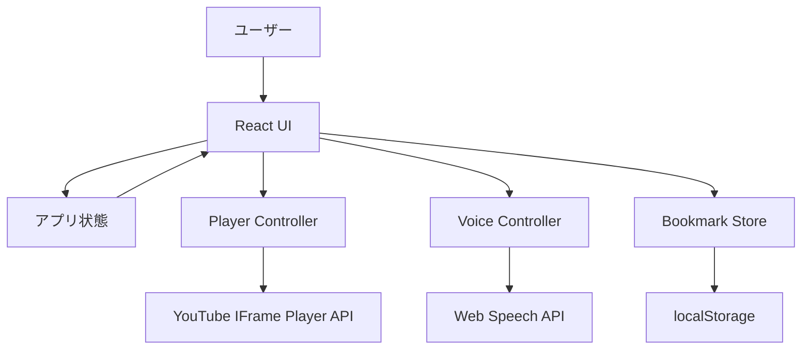
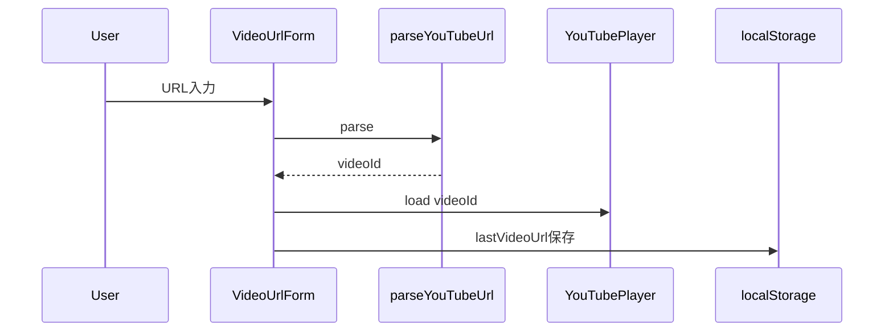
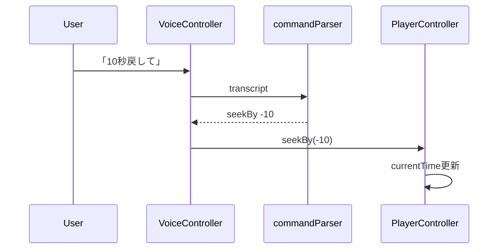
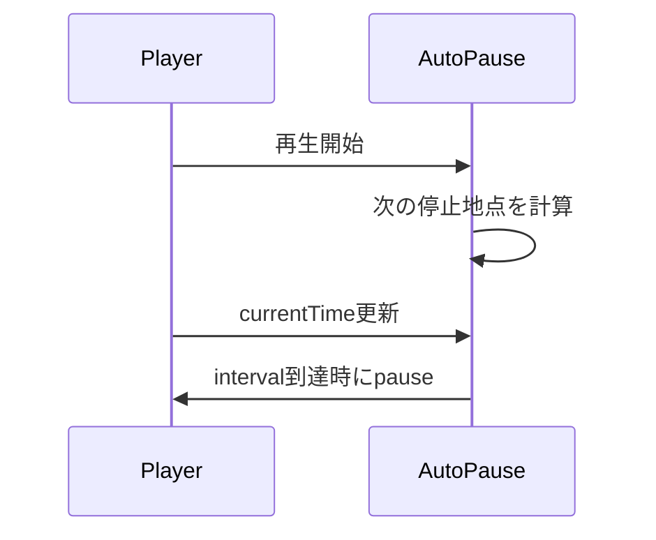

# 設計書

## 1. 概要

本アプリケーションは、YouTube の料理動画をハンズフリーに近い形で操作するための Web アプリである。Vite + React + TypeScript を用いてクライアントサイドアプリとして実装し、YouTube IFrame Player API で動画を制御する。音声操作には Web Speech API を使い、非対応環境では大きなタッチ UI にフォールバックする。

## 2. アーキテクチャ



## 3. 技術構成

- Vite
- React
- TypeScript
- CSS
- YouTube IFrame Player API
- Web Speech API
- localStorage
- Vitest
- Testing Library
- Playwright

## 4. ディレクトリ構成案

```text
yt-cooking-video/
  docs/
    requirements.md
    design.md
  src/
    App.tsx
    main.tsx
    styles/
      global.css
    components/
      VideoUrlForm.tsx
      YouTubePlayer.tsx
      ControlBar.tsx
      VoiceStatus.tsx
      AutoPausePanel.tsx
      BookmarkList.tsx
    hooks/
      useYouTubePlayer.ts
      useSpeechCommands.ts
      useAutoPause.ts
      useLocalStorage.ts
    lib/
      youtubeUrl.ts
      commandParser.ts
      time.ts
      storageKeys.ts
    types/
      youtube.ts
      speech.ts
      bookmark.ts
    test/
      youtubeUrl.test.ts
      commandParser.test.ts
```

## 5. 主要モジュール設計

### 5.1 `lib/youtubeUrl.ts`

YouTube URL から動画 ID を抽出する純粋関数を提供する。

対応する URL 形式:

- `https://www.youtube.com/watch?v=VIDEO_ID`
- `https://youtu.be/VIDEO_ID`
- `https://www.youtube.com/embed/VIDEO_ID`
- `https://www.youtube.com/shorts/VIDEO_ID`

主な関数:

```ts
type ParseYouTubeUrlResult =
  | { ok: true; videoId: string }
  | { ok: false; reason: "empty" | "invalid" };

function parseYouTubeUrl(input: string): ParseYouTubeUrlResult;
```

### 5.2 `hooks/useYouTubePlayer.ts`

YouTube IFrame Player API のロード、プレイヤー生成、再生制御を担当する。

責務:

- IFrame API script の遅延ロード
- `YT.Player` の生成
- player ready 状態の管理
- 再生、停止、シーク
- 現在時刻と再生状態の取得
- API エラーの通知

返す値の例:

```ts
type UseYouTubePlayerResult = {
  playerRef: RefObject<HTMLDivElement>;
  isReady: boolean;
  isPlaying: boolean;
  currentTime: number;
  duration: number;
  error: string | null;
  play: () => void;
  pause: () => void;
  seekBy: (seconds: number) => void;
  seekTo: (seconds: number) => void;
};
```

### 5.3 `lib/commandParser.ts`

音声認識結果の文字列をアプリ内コマンドへ変換する。

```ts
type VoiceCommand =
  | { type: "play" }
  | { type: "pause" }
  | { type: "seekBy"; seconds: number }
  | { type: "replay" }
  | { type: "saveBookmark" }
  | { type: "previousBookmark" };

function parseVoiceCommand(transcript: string): VoiceCommand | null;
```

日本語の揺れを吸収するため、完全一致ではなく部分一致と正規化を使う。

正規化例:

- 空白を除去
- 全角数字を半角数字へ変換
- `秒`、`びょう` の揺れを吸収

### 5.4 `hooks/useSpeechCommands.ts`

Web Speech API をラップし、認識開始、停止、認識結果、エラーを管理する。

責務:

- `SpeechRecognition` または `webkitSpeechRecognition` の存在確認
- 日本語 `ja-JP` で認識を開始
- 連続認識の制御
- 認識結果を `parseVoiceCommand` に渡す
- 認識エラーを UI に返す

注意:

- ブラウザが未対応の場合は `isSupported=false` を返す
- ユーザー操作なしで自動開始しない
- 認識が終了した場合、音声操作 ON の間は再開を試みる

### 5.5 `hooks/useAutoPause.ts`

再生開始からの経過時間を監視し、指定間隔で一時停止する。

入力:

- `enabled`
- `intervalSeconds`
- `isPlaying`
- `currentTime`
- `pause`

設計方針:

- プレイヤーの `currentTime` を基準にする
- 自動停止した時点の時刻を記録する
- ユーザーが再生を再開したら次の停止地点を再計算する
- シーク操作後は計測基準をリセットする

### 5.6 `BookmarkStore`

localStorage に動画 ID ごとのブックマークを保存する。

```ts
type Bookmark = {
  id: string;
  videoId: string;
  label: string;
  time: number;
  createdAt: string;
};
```

保存形式:

```json
{
  "VIDEO_ID": [
    {
      "id": "uuid",
      "videoId": "VIDEO_ID",
      "label": "手順 1",
      "time": 123.4,
      "createdAt": "2026-05-09T00:00:00.000Z"
    }
  ]
}
```

localStorage key:

- `ytCookingVideo:lastVideoUrl`
- `ytCookingVideo:settings`
- `ytCookingVideo:bookmarks`

## 6. UI 設計

### 6.1 画面構成

```text
+--------------------------------------------------+
| YouTube URL input                                |
+--------------------------------------------------+
|                                                  |
|                  YouTube player                  |
|                                                  |
+--------------------------------------------------+
| [戻る30] [戻る10] [停止/再生] [保存] [音声]       |
+--------------------------------------------------+
| 自動停止: ON/OFF  間隔: 15 / 30 / 60 秒           |
+--------------------------------------------------+
| ブックマーク一覧                                  |
| 00:12 手順 1                                      |
| 01:45 手順 2                                      |
+--------------------------------------------------+
```

### 6.2 レスポンシブ方針

- スマートフォンでは縦積みレイアウト
- タブレット以上では動画を大きく表示し、操作パネルとブックマークを下部または右側に配置
- 操作ボタンは最小 56px 以上の高さを確保する
- キッチンで離れて見ても状態が分かるよう、再生状態と音声状態を明確に表示する

### 6.3 操作 UI

主要ボタン:

- 30秒戻る
- 10秒戻る
- 再生 / 停止
- ブックマーク保存
- 音声操作 ON/OFF

設定 UI:

- 自動停止 ON/OFF
- 自動停止間隔の segmented control

状態表示:

- 動画ロード状態
- 音声認識状態
- 最後に認識したコマンド
- エラー表示

## 7. 状態設計

```ts
type AppSettings = {
  voiceEnabled: boolean;
  autoPauseEnabled: boolean;
  autoPauseIntervalSeconds: 15 | 30 | 60;
};

type AppState = {
  videoUrl: string;
  videoId: string | null;
  settings: AppSettings;
  bookmarks: Bookmark[];
  lastTranscript: string | null;
  lastCommand: VoiceCommand | null;
};
```

## 8. イベントフロー

### 8.1 動画 URL 入力



### 8.2 音声操作



### 8.3 自動一時停止



## 9. エラーハンドリング

| ケース | 表示・挙動 |
| --- | --- |
| URL が空 | URL 入力を促す |
| URL が YouTube ではない | YouTube URL を入力するよう表示 |
| 動画 ID 抽出失敗 | URL を確認するよう表示 |
| YouTube API ロード失敗 | 再読み込みを促す |
| 埋め込み不可動画 | YouTube 側で再生できない旨を表示 |
| 音声認識 API 非対応 | 音声操作はこのブラウザで使えないと表示 |
| 音声認識エラー | 音声操作を再度 ON にするよう表示 |
| localStorage 書き込み失敗 | 保存できないが操作は継続できるようにする |

## 10. テスト方針

### 10.1 Unit Test

対象:

- YouTube URL パース
- 音声コマンドパース
- 時刻フォーマット
- ブックマークの追加、削除、ソート

重点ケース:

- 複数形式の YouTube URL
- 不正 URL
- 日本語音声コマンドの揺れ
- 0秒未満へのシーク防止

### 10.2 Component Test

対象:

- URL 入力フォーム
- 操作バー
- 自動停止パネル
- ブックマーク一覧

### 10.3 E2E Test

対象:

- URL 入力からプレイヤー表示まで
- 操作ボタンの表示
- ブックマーク追加と localStorage 保存
- モバイル幅でのレイアウト崩れ確認

YouTube IFrame の実再生は外部依存が大きいため、E2E では API 境界をモックする方針とする。

## 11. 実装順序

1. Vite + React + TypeScript のセットアップ
2. 基本レイアウトと URL 入力
3. YouTube URL パース
4. YouTube IFrame Player API ラッパー
5. 再生、一時停止、巻き戻し UI
6. localStorage 設定保存
7. ブックマーク機能
8. 自動一時停止
9. 音声認識とコマンドパーサー
10. レスポンシブ調整
11. Unit Test
12. Playwright による表示確認

## 12. 将来拡張

- レシピ手順の自動分割
- YouTube 字幕からの手順抽出
- ユーザーアカウントとクラウド同期
- レシピ動画ごとの共有ブックマーク
- 音声コマンドのカスタマイズ
- ジェスチャー操作
- PWA 化
- オフラインでの設定確認
- 複数言語対応
